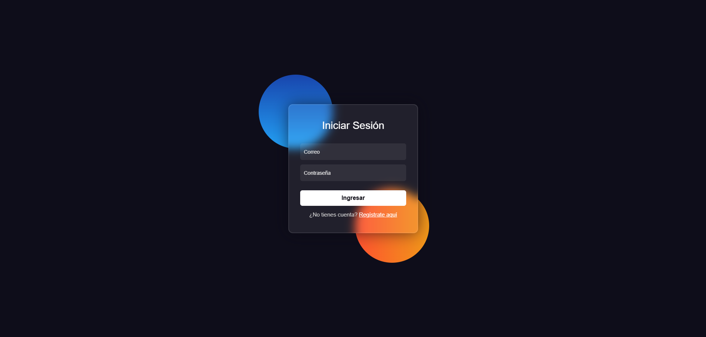

# Sistema de Ventas de Tableros Corp
## modulo de LOGIN y PANEL DE ADMINISTRACION
Aplicación web de e-commerce para gestión de productos y ventas. Incluye
dashboard, autenticación con JWT y gestión de productos.

------------------------------------------------------------------------

## Requisitos

-   **Node.js:** 24.14.0\
-   **MySQL:** 8.0+\
-   **Backend:** Puerto 3001
-   **Frontend:** Puerto 5500 (Live Server)

------------------------------------------------------------------------

## Instalación

``` bash
# 1. Backend
cd e-commerce-itp-iv-backend
npm install

# 2. Frontend
cd e-commerce-itp-iv-frontend
npm install
```

------------------------------------------------------------------------

## Ejecución


``` bash
# Terminal 1 - Backend
cd e-commerce-itp-iv-backend
npm run dev

# Terminal 2 - Frontend

# Abrir con Live Server:
# o usar liveserver pero abrir la url "http://127.0.0.1:5500/frontend/src/page/login.html"
src/page/login.html
```

------------------------------------------------------------------------

------------------------------------------------------------------------

## Funcionalidades


-   [x] Login / Logout con cookies\
-   [x] Dashboard con métricas\
-   [] Gestión de productos\
-   [x] Tema oscuro\
-   [x] gestion de usuarios
------------------------------------------------------------------------
## Como se maneja el front?

Se maneja de tal forma que el contenido cargado es dinamico, es decir en vez de usar la tipica estructura de muchos html se usa un contenedor dinamico priorizando el rendimiento de la pagina, algo asi como lo que hace en sigedin donde en una sola url cargas las distintas vistas de la pagina web

Usualmente para este tipo de modulos se maneja asi, es facil de entender, modificar, etc.


------------------------------------------------------------------------
##  Autor

**zexter27**
