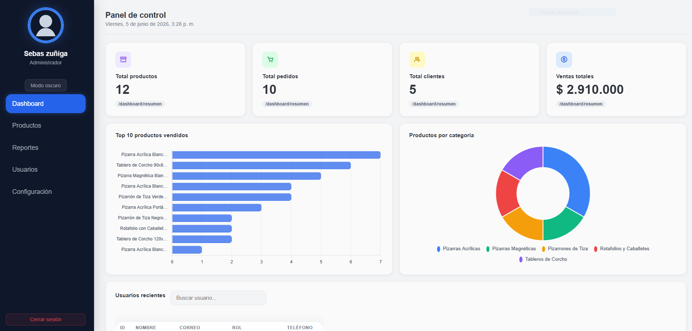

# Sistema de Ventas de Tableros Corp
## modulo de LOGIN y PANEL DE ADMINISTRACION
Aplicación web de e-commerce para gestión de productos y ventas. 

dashboard

------------------------------------------------------------------------

## Instalación

``` bash

# 2. Frontend
git clone https://github.com/Dayra1310/e-commerce-itp-iv-frontend.git
cd e-commerce-itp-iv-frontend
npm install
```

------------------------------------------------------------------------

## Ejecución


``` bash
# Terminal 1 - Backend
cd e-commerce-itp-iv-backend
npm run dev

# Terminal 2 - Frontend

# Abrir con Live Server:
# http://127.0.0.1:5500/e-commerce-itp-iv-frontend/src/page/login.html
#o usar liveserver pero abrir la url "http://localhost:5500/frontend/src/page/login.html"

```

------------------------------------------------------------------------


## Funcionalidades


-   [x] Login / Logout con cookies\
-   [x] Dashboard con métricas\
-   [x] Tema oscuro\
-   [x] gestion de usuarios
------------------------------------------------------------------------
## Como se maneja el front?

Se maneja de tal forma que el contenido cargado es dinamico, es decir en vez de usar la tipica estructura de muchos html se usa un contenedor dinamico priorizando el rendimiento de la pagina, algo asi como lo que hace en sigedin donde en una sola url cargas las distintas vistas de la pagina web

el tipo de pagina se llama SPA
Usualmente para este tipo de modulos se maneja asi, es facil de entender, modificar, etc.




aun en desarrollo

------------------------------------------------------------------------
##  Autor

**zexter27**
